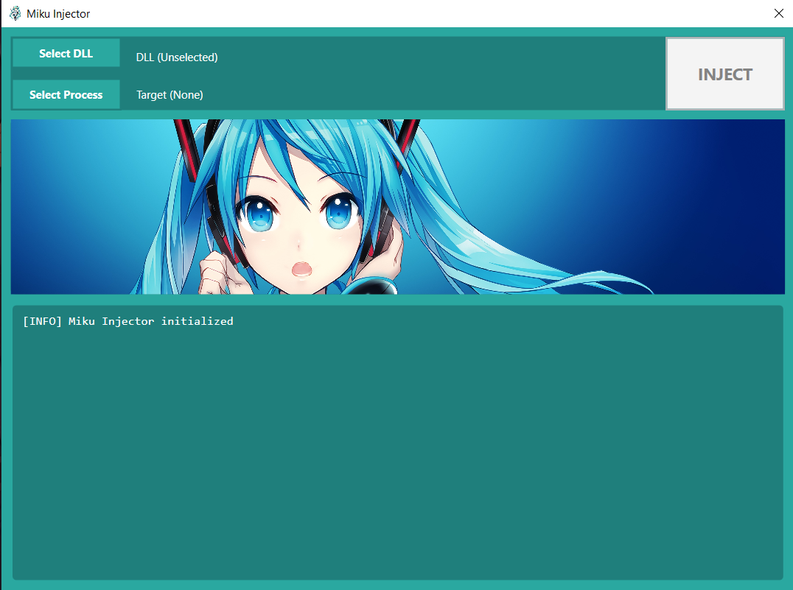

# Miku Injector 💙

Miku Injector is a DLL injector with a graphical user interface themed around Hatsune Miku, developed using WPF.  
It supports both **x86** and **x64** DLL injection, automatically handling architecture compatibility.

## Features

### UI
- Simple and clean layout with a custom Hatsune Miku theme.

### Logging System
- Built-in log panel that displays real-time information about the injection process, including status messages and errors.

### Async Injection
- The injection process runs asynchronously, keeping the interface responsive and preventing the application from freezing during injection.

### Safety Checks
- Before injecting, the injector compares the DLL architecture with the target process architecture to ensure compatibility and avoid crashes.

## Disclaimer
- This project is intended for educational purposes and for use in environments where you have explicit permission.  
Misuse of this tool may violate software licenses or local laws.
